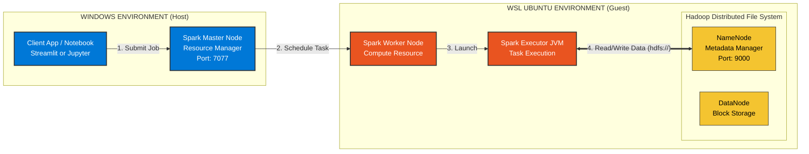
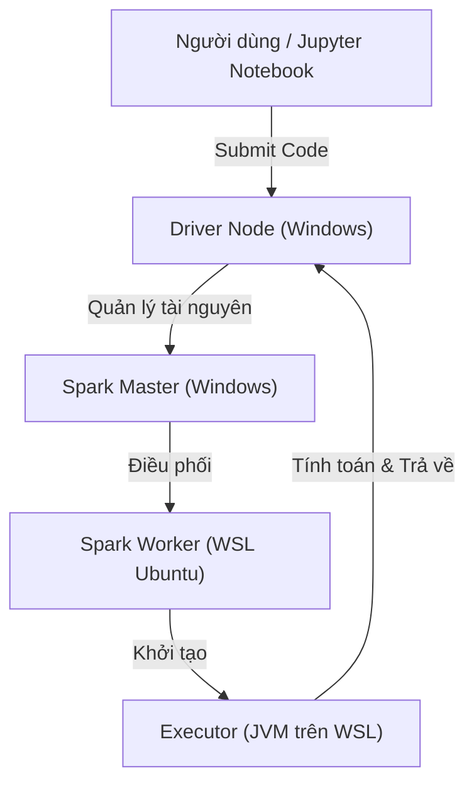

# TÀI LIỆU KỸ THUẬT: TRIỂN KHAI HỆ THỐNG SPARK CLUSTER HYBRID & HDFS

## 1. TỔNG QUAN KIẾN TRÚC

Hệ thống hoạt động theo mô hình **Master-Slave**:

* **Master Node (Windows):** Chạy Spark Master (Quản lý tài nguyên).
* **Worker Node (WSL - Ubuntu):** Chạy Spark Worker (Tính toán) và Hadoop HDFS (Lưu trữ).

### Sơ đồ luồng dữ liệu (Architecture Diagram)





---

## 2. THIẾT LẬP MÔI TRƯỜNG & TẢI PACKAGE

### 2.1. Tại Windows (Master Node)

Cài đặt thủ công các thành phần sau:

1. **Java 11:** Cài đặt JDK, set biến môi trường `JAVA_HOME`.

2. **Spark:** Tải và giải nén Spark 3.4.1.
* Tải `spark-3.4.1-bin-hadoop3.tgz` từ trang chủ Spark.
* Giải nén vào `C:\Spark`.
* Set `SPARK_HOME = C:\Spark`.
* Thêm `%SPARK_HOME%\bin` vào biến `PATH`.

3. **Hadoop Utils:** Tải `winutils.exe` (Hadoop 3.3) bỏ vào `%HADOOP_HOME%\bin`.
* Tải `winutils.exe`.
* Tạo thư mục `C:\hadoop\bin` và bỏ `winutils.exe` vào đó.
* Set `HADOOP_HOME = C:\hadoop`.
* Thêm `%HADOOP_HOME%\bin` vào biến `PATH`.

4. **Python Environment:**
```cmd
python -m venv venv
.\venv\Scripts\activate
pip install -r requirements.txt

```


### 2.2. Tại WSL Ubuntu (Worker Node & Storage)

Chạy lần lượt các block lệnh sau trong Terminal WSL để tải và cài đặt:

**A. Cài đặt Java và Python Environment**

```bash
# Cập nhật và cài Java 11
sudo apt update
sudo apt install openjdk-11-jdk -y

# Thêm kho chứa Python (cho các bản cũ/mới)
sudo apt install software-properties-common -y
sudo add-apt-repository ppa:deadsnakes/ppa -y

# Cài Python 3.10 và các công cụ
sudo apt update
sudo apt install python3.10 python3.10-distutils python3.10-venv -y

# Cài pip và thư viện PySpark
curl -sS https://bootstrap.pypa.io/get-pip.py | sudo python3.10
sudo python3.10 -m pip install pyspark numpy pandas

```

**B. Tải và Cài đặt SPARK (Từ nguồn lưu trữ)**

```bash
cd ~
# Link tải Spark 3.4.1
wget https://apache.root.lu/spark/spark-3.4.1/spark-3.4.1-bin-hadoop3.tgz

# Giải nén và đổi tên thư mục
tar -xvf spark-3.4.1-bin-hadoop3.tgz
mv spark-3.4.1-bin-hadoop3 spark

```

**C. Tải và Cài đặt HADOOP (Từ trang chủ Apache)**

```bash
cd ~
# Link tải Hadoop 3.3.6
wget https://dlcdn.apache.org/hadoop/common/hadoop-3.3.6/hadoop-3.3.6.tar.gz

# Giải nén và đổi tên thư mục
tar -xvf hadoop-3.3.6.tar.gz
mv hadoop-3.3.6 hadoop

```

**D. Cài đặt SSH (Bắt buộc cho Hadoop)**

```bash
sudo apt install openssh-server -y
sudo service ssh start

# Tạo key login không mật khẩu
ssh-keygen -t rsa -P '' -f ~/.ssh/id_rsa
cat ~/.ssh/id_rsa.pub >> ~/.ssh/authorized_keys
chmod 0600 ~/.ssh/authorized_keys

# Test (Nếu không hỏi mật khẩu là OK)
ssh localhost exit

```

---

## 3. CẤU HÌNH HỆ THỐNG (CONFIGURATION)

### 3.1. Cấu hình Biến môi trường (.bashrc)

Thực hiện trên WSL để lưu cấu hình vĩnh viễn.

```bash
nano ~/.bashrc

```

Thêm vào cuối file:

```bash
# JAVA ENV
export JAVA_HOME=/usr/lib/jvm/java-11-openjdk-amd64

# HADOOP ENV
export HADOOP_HOME=~/hadoop
export PATH=$PATH:$HADOOP_HOME/bin:$HADOOP_HOME/sbin

# SPARK ENV
export SPARK_HOME=~/spark
export PATH=$PATH:$SPARK_HOME/bin:$SPARK_HOME/sbin

```

Chạy lệnh cập nhật: `source ~/.bashrc`.

### 3.2. Cấu hình Hadoop XML

Chỉnh sửa file trong `~/hadoop/etc/hadoop/`:

* **`nano core-site.xml`**:
```xml
<configuration>
    <property>
        <name>fs.defaultFS</name>
        <value>hdfs://0.0.0.0:9000</value>
    </property>
</configuration>

```


* **`nano hdfs-site.xml`**:
```xml
<configuration>
    <property>
        <name>dfs.replication</name>
        <value>1</value>
    </property>
    <property>
        <name>dfs.namenode.name.dir</name>
        <value>/home/ubt_trgmai/hdfs_data/namenode</value> 
    </property>
    <property>
        <name>dfs.datanode.data.dir</name>
        <value>/home/ubt_trgmai/hdfs_data/datanode</value>
    </property>
</configuration>

```


*(Thay `ubt_trgmai` bằng user của bạn)*.
* **`nano hadoop-env.sh`**:
```bash
export JAVA_HOME=/usr/lib/jvm/java-11-openjdk-amd64

```


---

## 4. VẬN HÀNH & QUẢN LÝ (OPERATION & MONITORING)

### 4.1. Khởi động HDFS (Trên WSL)

```bash
# Chỉ chạy lệnh này LẦN ĐẦU TIÊN
hdfs namenode -format 

# Khởi động dịch vụ
start-dfs.sh

```

### 4.2. Khởi động Spark Cluster (Tự động)

Sử dụng script `config_ip.py` có sẵn trong dự án để lấy lệnh chạy chính xác.

1. Tại **Windows CMD**: `python config_ip.py` -> Copy lệnh và chạy để bật Master.
2. Tại **WSL Terminal**: Copy lệnh từ kết quả trên và chạy để bật Worker.

### 4.3. Các Link Quản lý Hệ thống (Web UI)

Sau khi khởi động thành công, truy cập các địa chỉ sau để giám sát:

| Thành phần | Chức năng | Địa chỉ truy cập (URL) |
| --- | --- | --- |
| **Spark Master** | Quản lý tổng Cluster (Xem Worker, App) | `http://localhost:8080` (hoặc IP_Win:8080) |
| **Spark Worker** | Xem chi tiết log xử lý | `http://localhost:8081` |
| **Spark Context** | Xem Job đang chạy (DAG Visualization) | `http://localhost:4040` (Chỉ hiện khi App đang chạy) |
| **Hadoop HDFS** | Quản lý file, xem dung lượng DataNode | `http://localhost:9870` |

### 4.4. Upload dữ liệu mẫu

```bash
# Tạo thư mục và upload file
hdfs dfs -mkdir -p /project/input

# Cú pháp: hdfs dfs -put <đường_dẫn_windows_trong_wsl> <đích_hdfs>
hdfs dfs -put /mnt/d/Mall_Customers.csv /project/input/

# Liệt kê file trong thư mục input để đảm bảo upload thành công
hdfs dfs -ls /project/input/

# Cấp quyền đọc/ghi (nếu cần thiết cho Spark User)
hdfs dfs -chmod -R 777 /project/input/

```

## 5. Streamlit

**Online** https://ie405f11cn2cntt.streamlit.app/

**Khởi chạy Streamlit local** `streamlit run app.py`